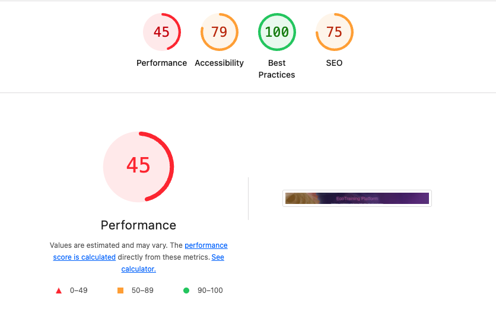
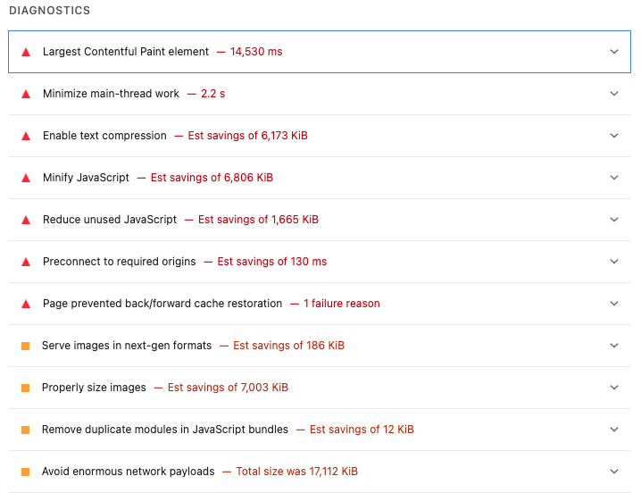

# Audit Initial EcoTraining Platform

## Outils utilisés: 
- GreenIt
- Lighthouse
- RGAA accessibilité

## Résultats GreenIT

- EcoIndex : D (44,98)
- Eau: 3,15cl
- GES: 2,1° gCO2e
- Nombre de requêtes: 1468
- Taille de la page: 17589 Ko
- Taille du DOM: 140

## Résultats Lighthouse

## Résultats accessibilité

- 7.6. Prévoir un moyen pour contrôler chaque contenu animé: supprimer ou stopper l'animation
- texte changeant de couleur (clignotement/contraste) : fixer la couleur

## Principaux problèmes identifiés

- le poids de la page
- le nombre de requêtes
- les animations 
- les fonctionnalités pas nécessaires (blocs 3D threeJS en boucle)